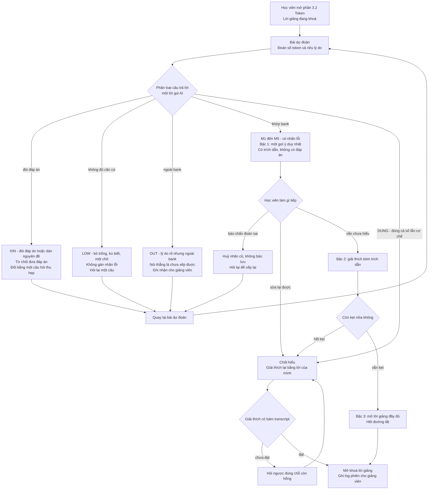

# CP2 — Luồng hoạt động · VLearn FailFirst (D2)

> **Mốc CP2 chưa cần AI chạy thật.** Bản mock bấm được: [`codebase/mock/index.html`](../codebase/mock/index.html) — tải về mở bằng trình duyệt, không cần cài gì.
> Ở mock, bước chẩn đoán chạy bằng **luật từ khoá**, không gọi LLM. CP3 mới thay bằng lời gọi AI thật + `tiktoken` thật.

## Lát cắt đang hiện thực

> Một học viên · trước khi được xem phần giảng về token, trả lời bài dự đoán "đoạn tiếng Việt ~100 từ này tốn bao nhiêu token — nhiều hay ít hơn số từ, vì sao" · **AI chẩn đoán đúng giả định sai cụ thể** rồi chỉ đưa **một** gợi ý kèm trích dẫn transcript, không đưa đáp án · học viên tự sửa và giải thích lại được.

## Sơ đồ luồng

## 4 đường đi trải nghiệm (R3 yêu cầu đủ 4)

| Đường | Kích hoạt khi | Hệ thống làm gì | Bấm thử trong mock |
|---|---|---|---|
| **Happy** | Trả lời sai, nêu được lý do khớp bank | Gán nhãn `M1`–`M5` → bậc 1 một gợi ý → học viên sửa → chốt hiểu → mở lời giảng | Kịch bản `Happy` |
| **Low-confidence** | Bỏ trống lý do, "ko biết", trả lời một chữ | Nhãn `LOW` — **không gán lỗi bừa**, hỏi lại một câu thu hẹp | Kịch bản `Low-confidence` |
| **Failure** | Lý do rõ ràng nhưng không khớp bank | Nhãn `OUT` — nói thẳng "chưa xếp được lỗi của bạn", ghi nhận cho giảng viên, không bịa nhãn | Kịch bản `Failure` |
| **Correction** | Học viên bảo "chẩn đoán sai rồi, ý tôi là…" | Huỷ nhãn cũ, không bảo lưu, hỏi lại để xếp lại | Kịch bản `Correction` |

Hai nhãn còn lại do bản CP3 bổ sung sau khi chạy eval: `XIN` (đòi đáp án, dán nguyên đề) và `DUNG` (đúng cả số lẫn cơ chế — đi thẳng tới bước chốt hiểu, không gán lỗi).

Nhãn `XIN` phủ **lớp chỗ khó số 3 — ngoài phạm vi / thẩm quyền**: bấm "Cho đáp án luôn" thì hệ thống từ chối nhưng vẫn hữu ích. Đây đúng là hành vi đã mining được trong chatlog: 103 lượt / 38 học viên dán đề hoặc xin làm hộ.

## Misconception bank dùng trong mock

| Mã | Giả định sai | Dấu hiệu trong câu trả lời |
|---|---|---|
| `M1` | token = từ | "mỗi từ một token", "bằng số từ", đoán đúng 100 |
| `M2` | token = ký tự | "ký tự", "chữ cái" |
| `M3` | tiếng Việt và tiếng Anh tốn token như nhau | "như nhau", "giống tiếng Anh", "không khác" |
| `M4` | nhầm token đầu vào với token đầu ra | "đầu ra", "output", nhắc giá gấp 3–5 lần |
| `M5` | đúng kết quả nhưng đoán | số nằm trong khoảng đúng mà lý do không giải thích được |

Bank này ở CP2 mới là bản nháp 5 nhãn. Trước CP4 phải dựng lại từ **câu hỏi token thật trong chatlog** (67 lượt / 33 học viên) và dẫn `turn_id`.

## Cái gì là mock, cái gì sẽ thật

| Thành phần | CP2 (bây giờ) | CP3 trở đi |
|---|---|---|
| Đếm token | Số cứng `186`, gắn nhãn MOCK | `tiktoken` chạy thật (`o200k_base`) |
| Chẩn đoán lỗi | Luật từ khoá trong `index.html` | **Lời gọi AI thật** — đây là quyết định trung tâm |
| Trích dẫn transcript | Trích cứng `[T06-134]`, `[T04-049]` | Lấy từ transcript có mã đoạn |
| Chấm "giải thích lại đạt chưa" | Luật từ khoá | Lời gọi AI thật, đối chiếu transcript |
